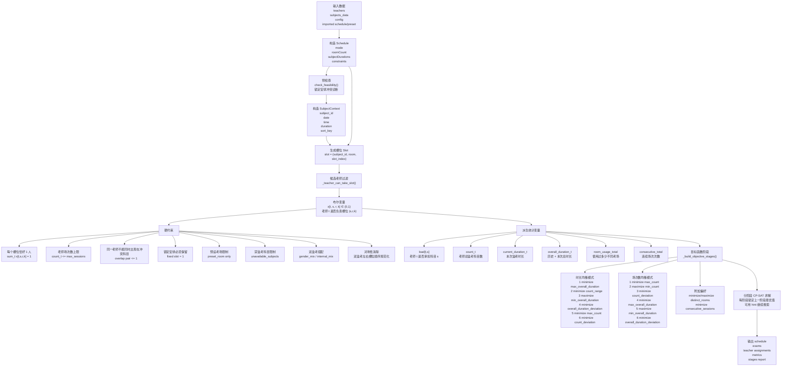

# 监考编排 CP-SAT 结构图

本文档根据当前仓库代码整理监考编排求解器的结构，重点覆盖变量、约束、目标函数和求解流程。

相关代码入口：

- `backend/rpc_server.py`
- `backend/application/proctoring_service.py`
- `backend/proctoring/core/cp_sat/solver.py`
- `backend/proctoring/core/cp_sat/assignment.py`
- `backend/proctoring/core/cp_sat/objectives.py`
- `backend/proctoring/core/validators.py`

## 1. 结构图

## 2. 读图说明

### 2.1 变量层

- 核心决策变量是 `x[t,s,r,k]`
- 含义是“老师 `t` 是否被分配到科目 `s`、考场 `r`、槽位 `k`”
- 这是一个布尔变量，也是整个模型唯一真正做离散决策的主变量

### 2.2 约束层

- 每个监考槽位必须且只能有一位老师
- 每位老师的总监考段数不能超过 `max_sessions`
- 同一老师不能被安排到时间重叠的两个科目
- 导入并锁定的位置必须保留
- 如果教师设置了预设考场，则只能出现在对应考场
- 如果教师设置了禁监考科目，则对应科目不能分配
- 双监考模式下可以额外启用性别搭配和本外校搭配

### 2.3 目标函数层

- 求解器不是把所有目标做成一个总加权和
- 当前实现采用“分阶段字典序优化”
- 即先求最重要目标的最优值，再把该值锁住，继续优化下一目标
- 这样能减少权重难调的问题，也更符合排班系统里的“主目标优先，次目标细化”思路

## 3. 代码映射

- 求解入口：`backend/application/proctoring_service.py`
- 主求解器：`backend/proctoring/core/cp_sat/solver.py`
- 候选过滤与冲突对构造：`backend/proctoring/core/cp_sat/assignment.py`
- 目标阶段定义：`backend/proctoring/core/cp_sat/objectives.py`
- 预检查：`backend/proctoring/core/validators.py`
- 结果指标：`backend/proctoring/core/cp_sat/metrics.py`

## 4. 备注

- 本文档描述的是当前仓库实现，不是抽象设计稿
- 如果后续新增目标函数或搭配约束，建议同步更新这张 Mermaid 图
