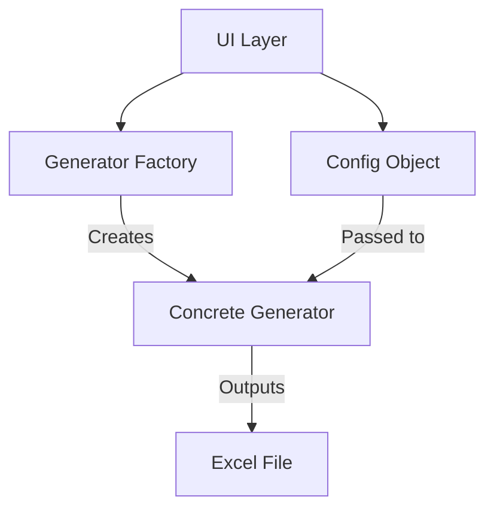

# 功能迁移模块开发规范 (Development Guidelines)

本模块用于封装与“资料打印”相关的业务逻辑。为了保持代码的高内聚、低耦合以及良好的可扩展性，所有后续的功能拓展（如新增打印类型）都**必须**遵循以下规范。

## 1. 架构概览

本模块采用 **Config-Factory-Generator** 模式，将数据定义、对象创建和业务逻辑完全解耦。



## 2. 核心原则

1.  **UI 与逻辑分离**：
    *   `ui/` 目录下的代码只负责界面展示、参数收集和线程调用。
    *   **严禁**在 UI 类中编写 Excel 生成逻辑。
    *   **严禁**在 Core 类中引入 `PyQt5` 或其他 UI 库。

2.  **配置驱动**：
    *   所有业务参数必须封装在 `Config` 数据类中（见 `core/config.py`）。
    *   严禁使用字典（dict）传递复杂参数。

3.  **统一接口**：
    *   所有的生成器必须实现统一的 `generate(progress_callback)` 接口。

## 3. 如何拓展新功能

假设你要添加一个“准考证打印”功能，请按照以下步骤操作：

### 步骤 1：定义配置类

在 `core/config.py` 中继承 `BaseConfig`，定义该功能所需的参数。

```python
# core/config.py
@dataclass
class TicketConfig(BaseConfig):
    """准考证生成配置"""
    exam_name: str
    students: List[dict]
    show_photo: bool = True
```

### 步骤 2：实现生成器

在 `core/` 目录下新建文件（如 `ticket_generator.py`），实现生成逻辑。

```python
# core/ticket_generator.py
class TicketGenerator:
    def __init__(self, config: TicketConfig):
        self.config = config

    def generate(self, progress_callback=None):
        # 1. 获取配置
        output_path = self.config.output_path
        
        # 2. 执行生成逻辑 (使用 openpyxl)
        # ...
        
        # 3. 报告进度
        if progress_callback:
            progress_callback(50, 100)
            
        return output_path
```

### 步骤 3：注册到工厂

修改 `core/factory.py`，让工厂能够识别新的 Config 并返回对应的 Generator。

```python
# core/factory.py
from .config import TicketConfig
from .ticket_generator import TicketGenerator

class GeneratorFactory:
    @staticmethod
    def create_generator(config: BaseConfig):
        # ... 现有代码 ...
        elif isinstance(config, TicketConfig):
            return TicketGenerator(config)
```

### 步骤 4：UI 集成

在 `ui/windows/print_window.py` 中：
1.  新增一个 Tab 页或配置区域。
2.  收集用户输入，构建 `TicketConfig` 对象。
3.  调用 `GeneratorThread(config)` 启动任务。

**注意**：`GeneratorThread` 已独立为 UI 线程模块（见 `ui/threads/`），一般不需要改动，因为它已按 Config/GeneratorFactory 模式工作。

## 4. 目录结构说明

```
功能迁移/
├── core/                   # 核心业务逻辑 (无 UI 依赖)
│   ├── config.py           # [关键] 所有配置数据类定义
│   ├── factory.py          # [关键] 生成器工厂
│   ├── adapters/           # 外部数据源适配（如：考场编排 DataFrame -> list[dict]）
│   ├── validators/         # 数据校验（如：导入数据排序校验）
│   ├── generators/         # 生成器实现
│   │   ├── excel/          # Excel 生成器 (openpyxl)
│   │   └── pdf/            # PDF 生成器 (reportlab)
│   └── utils/              # Core 工具模块
│       └── data_loader.py  # 通用数据加载工具
├── ui/                     # 界面层
│   ├── windows/            # 主窗口/页面容器
│   ├── dialogs/            # 对话框
│   ├── widgets/            # 可复用控件
│   ├── tabs/               # Tab 初始化与UI组装
│   ├── services/           # UI侧的任务编排/配置构建
│   ├── threads/            # UI线程封装
│   └── ...                 # 兼容旧导入的转发模块
├── assets/                 # 资源文件
│   └── images/             # 图片资源
└── __init__.py
```

## 5. 代码风格

*   **类型提示**：所有公共方法都应包含 Type Hint。
*   **异常处理**：Core 层遇到错误应抛出异常，由 UI 层统一捕获并显示弹窗。
*   **依赖管理**：新增第三方库依赖时，请确保 `requirements.txt` 同步更新。
