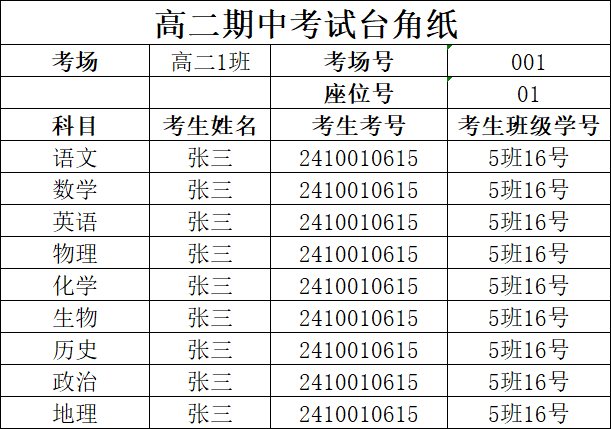

# 智能考务系统（v1.8.0103）用户使用说明

本说明只讲“怎么用”，不解释原理与代码细节。建议按“快速上手”顺序操作：先科目 → 再监考 → 再考场 → 最后资料打印。

---

## 1. 启动与授权

### 1.1 启动方式

- 运行 EXE：双击 `dist/智能考务系统v1.8.0103.exe`
- 运行源码：在项目目录执行 `python main.py`

### 1.2 首次启动（证书校验）

首次启动可能会弹出“证书校验”窗口：

1. 点击“复制机器码”，把机器码发给管理员/供应方获取注册码。
2. 将获得的注册码粘贴到输入框。
3. 点击“验证注册码”。
4. 验证通过后会自动进入主窗口；下次启动通常会直接进入主窗口。

常见情况：
- 验证失败：优先检查是否复制/粘贴了多余空格、是否拿错机器码对应的注册码。

---

## 2. 主界面认识

主窗口顶部有 5 个功能入口：

- 科目设置
- 监考编排
- 考场编排
- 资料打印
- 使用说明

右下区域通常会显示日志/提示，生成任务时会显示进度条。

---

## 3. 快速上手（推荐流程）

### 3.1 第一步：科目设置（准备考试科目与时间）

进入“科目设置”页：

1. 设置“考试科目数”。
2. 逐科目填写：
   - 科目名称
   - 考试日期
   - 考试时间（如 `08:30-10:30`）
   - 备注（可选）
3. 每个科目填好后点击“添加/更新科目”保存。
4. 可用“导入科目信息”从 Excel 一次性导入；也可用“导出科目信息”保存备份。

科目信息模板（生成模板文件）：
- 必填列：科目名称、考试日期、考试时间
- 可选列：考试时长（分钟）、备注

### 3.2 第二步：监考编排（导入教师并生成监考安排）

进入“监考编排”页：

1. 先设置“考场数”“监考模式（单/双）”“均衡模式（场次/时长）”。
2. 点击“生成模板文件”得到教师信息模板，按模板填写后点击“导入教师信息”导入。
3. 如是“双监考”，可按需勾选：
   - 男女搭配
   - 本外校搭配
4. 点击“安排监考”生成结果。
5. 如少量不满意，使用“手动调整”在“监考总览表”中交换两个单元格的监考老师。
6. 点击“导出安排结果”导出 Excel。

教师信息模板提示：
- 必填列：姓名
- 其余建议按模板填写完整（性别/是否本校/最大监考段数/不监考科目/历次监考时长等），可提升排布质量与约束满足度。

### 3.3 第三步：考场编排（生成座位/考场号/座位号）

进入“考场编排”页，完成“考生名册 → 考场座位”编排：

1. 点击“生成模板文件”，生成并填写：
   - 考场设置模板（序号、考场号、考场人数；考场为可选）
   - 考生名册模板（顺序/随机）或（3+1+2 选科）
2. 先“导入考场设置”，再“导入考生名册”。
3. 选择编排模式：
   - 顺序编排：按名册顺序分配
   - 随机编排：随机打散后分配
   - 3+1+2 选科编排：按选科组合分散安排
4. 点击“开始考场编排”。
5. 编排完成后点击“导出考场编排”保存 Excel。

考场座位示意图（示例）：

### 3.4 第四步：资料打印（批量生成打印资料）

进入“资料打印”页，包含 4 个子页签：

- 台角纸生成
- 桌角纸生成
- 准考证生成
- 考生信息表生成

通用使用步骤（所有子页签都适用）：

1. 选择“数据来源”：
   - 生成空白模板：只生成空表（用于打印或后续手工填写）
   - 导入考生数据：从 Excel 导入，通常会弹出“列映射”窗口（把 Excel 表头映射到系统字段）
   - 从考场编排导入：直接读取“考场编排”页当前编排结果（建议优先使用）
2. 选择“保存路径”。
3. 勾选输出格式：
   - Excel（可编辑）
   - PDF（推荐打印更稳定）
4. 点击“开始生成”，等待进度条完成；完成后可选择打开文件夹。

台角纸示例图：

---

## 4. 资料打印各功能详解

### 4.1 台角纸生成

适用：考场/座位台角纸批量打印。

推荐做法：
- 先在“考场编排”完成编排 → 再在“台角纸生成”选择“从考场编排导入” → 直接导出 PDF。

### 4.2 桌角纸生成

适用：桌角纸与座位布局打印。

要点：
- 先在“座位布局设置”里设置布局（行列、排布方式等）。
- 数据来源推荐“从考场编排导入”。
- 预览区可在“座位布局 / 桌角纸”两个标签间切换查看效果。

### 4.3 准考证生成

适用：批量生成准考证（含科目与考试时间）。

要点：
- 点击“设置考试科目”配置科目与时间（可参考“科目设置”页）。
- 数据来源推荐“从考场编排导入”。
- 输出格式推荐 PDF。

### 4.4 考生信息表生成（班级 / 考场）

适用：生成可打印的考生信息汇总表，支持按“班级”或按“考场”两种组织方式。

1. 在右侧“模板预览”中选择：
   - 班级：生成“考生信息表（班级）”
   - 考场：生成“考生信息表（考场）”
2. 默认标题与默认文件名会随页签变化：
   - 班级：标题默认“座位安排-班级”，文件名默认“考生信息表（班级）_批量生成”
   - 考场：标题默认“座位安排-考场”，文件名默认“考生信息表（考场）_批量生成”
3. 考场模式的汇总行：
   - “xxx 计数”显示在“考场”列（更符合打印阅读习惯）
4. 考场模式的 Excel 分 Sheet：
   - 每个考场一个 sheet
   - sheet 名为“考场”字段（例如“高二1班”）

---

## 5. 模板文件与必填列（汇总）

建议优先使用软件内“生成模板文件”，再按模板填数据，导入成功率最高。

### 5.1 科目信息模板

- 文件：科目信息模板.xlsx
- 必填列：科目名称、考试日期、考试时间
- 可选列：考试时长（分钟）、备注

### 5.2 教师信息模板

- 文件：教师信息模板.xlsx
- 必填列：姓名
- 建议列：性别、是否本校、最大监考段数、不监考科目、历次监考时长（分钟）、预设监考考场

### 5.3 考场设置模板

- 文件：考场设置模板.xlsx
- 必填列：序号、考场号、考场人数
- 可选列：考场（未填会自动生成）

### 5.4 考生名册模板

- 顺序/随机：班级、学号、考号、姓名
- 3+1+2：班级、学号、考号、姓名、选科

### 5.5 打印页“导入考生数据”通用必填字段

当你在“资料打印”里选择“导入考生数据”时，会弹出“列映射”窗口。以下字段通常必须能映射到 Excel 表头：

- 考场、考场号、座位号、考生姓名、考生考号、班级、学号

---

## 6. 常见问题（快速排查）

### 6.1 监考安排不完整 / 部分考场没人

优先检查：
- 教师人数是否不足（双监考需要更多教师）
- “最大监考段数”是否过小
- “不监考科目”限制是否过多
- 双监考下是否同时启用了过多约束（男女搭配/本外校搭配）

建议操作：
- 放宽约束、增加教师、提高最大监考段数后重新“安排监考”
- 使用“补全监考安排”（若界面提供）
- 用“手动调整”微调

### 6.2 导入失败（提示缺列或格式不正确）

建议操作：
- 先用“生成模板文件”拿到标准模板，再把你的数据复制进去导入
- 确认 Excel 表头没有合并单元格、没有前后空格
- 日期/时间按示例格式填写

### 6.3 资料打印导入时不知道怎么映射列

建议操作：
- 优先选择“从考场编排导入”，无需映射
- 如必须导入：确保 Excel 表头包含“考场/考场号/座位号/姓名/考号/班级/学号”对应信息，再在映射窗口逐项选择

---

## 7. 演示与参考文件

- 演示视频：`使用演示.mp4`
- 参考 Excel：见 `参考文件/` 目录（包含科目信息、考场设置、考生名册、考场编排结果等示例）
